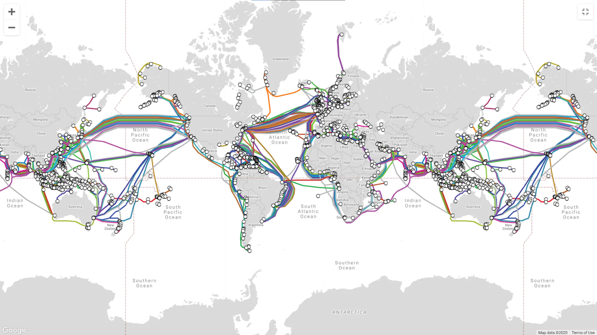
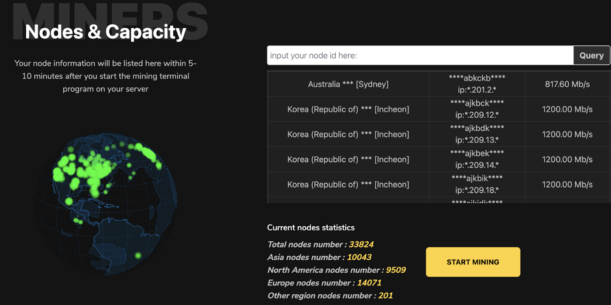
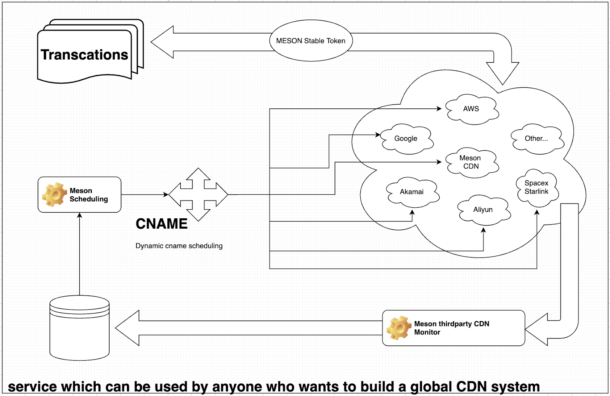

# Bandwidth Marketplace

## What is bandwidth?

1. As shown in the figure below, the global Internet is linked by a backbone of cable networks that connect different countries and continents, some spanning the entire Atlantic or Pacific Ocean.

2. Satellite communication is another telecommunication method. SpaceX’s star-link project is gradually being constructed and adopted.

Whether it is a submarine optical cable or a satellite communication method, the bandwidth cost of telecommunication remains high due to the limited capacity and constant wear of the physical infrastructure of telecommunication in the physical world.

## Bandwidth business and CDN

To deal with the gradual decline of the physical infrastructure, operators in various countries are responsible for maintaining and monetizing their local cable infrastructure. To optimize monetization, operators in various countries have adopted similar operating strategies, which is to divide bandwidth usage into

- Residential bandwidth
- Commercial bandwidth

The main difference between the two is that the residential bandwidth is shared by users. There is no independent public-static-IP. Compared with commercial bandwidth, although residential bandwidth is relatively cheap, it is too unstable to be used to support commercial services. The main buyers of commercial bandwidth come from CDN companies such as Google, Akamai, AWS, Aliyun, and other large Internet companies that will purchase a large amount of bandwidth from local operators and build server rooms to provide CDN services to the outside world. In the end, Internet companies will purchase these CDN services.

Due to the large price asymmetry and time asymmetry between CDN companies, the CDN industry has a lot of idle resources. It is worth noting that the idle bandwidth rate of particularly large CDN vendors sometimes reaches 80%.

## Outlook for Web3.0

Web2.0 companies that provide video streaming, online games and other stream services spend huge amounts of money on CDN every year, mainly due to the need to distribute a large amount of content to users at a high speed.

From the point of view of Web3.0, the financial transaction data of BTC and ETH was not very large before, but it has been growing at significant speeds. The aggregate of transaction data size of ETH comes to 1–2TB level, which is a small amount of data compared to the traditional Internet. However, with the advent of Web3.0, more user data is being generated, and demand for content and delivery speed from Metaverse and Gamefi is expected to grow exponentially. The volume of Web 3 data is exploding.

## The principle of Meson Network

Meson Network works through two major components:

- Meson Network aggregates idle commercial bandwidth using blockchain to provide CDN services.
- Meson Network integrates the supplies of third-party CDN companies through blockchain.

1. Aggregate idle commercial bandwidth

Through the use of incentives, Meson Network currently gathers more than 30,000 nodes around the world, with a total bandwidth of about 40Tb/s. On this basis, Meson Network provides low-cost and high-quality CDN services at a global scale.

2. Integration of third-party CDN agreements

Meson Network provides a set of standards that can facilitate real-time resource scheduling and transaction settlement for all third-party CDNs around the world. This standard protocol is more like a stable transaction settlement and scheduling resource system for bandwidth resources. This system is somewhat similar to the real-time bidding system (RTB) in the advertising industry in terms of architecture.

As shown in the figure, anyone can integrate and use global third-party CDN resources through Meson’s standard service system and Meson’s bandwidth transaction settlement system. Through MESON, global CDN bandwidth resources can be fully utilized.

