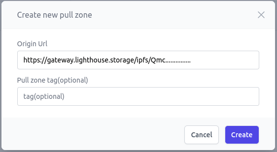

# Meson Lighthouse Storage Geliştiriyor

## **Lighthouse'u Meson ile Kullanma: Kapsamlı Bir Eğitim**

### **giriiş**

Dijital verilerin tanımladığı bir çağda, güvenilir ve kalıcı bir dosya depolama çözümü çok önemlidir. **Lighthouse**, uzun vadeli depolama için tasarlanmış bir depolama modeli sunarak bu alanda lider olarak ortaya çıkıyor. Filecoin ağının ve IPFS içerik adresleme sisteminin madenci ağını ve depolama kapasitesini kullanır.
Lighthouse'un IPFS'ye olan güveni, Filecoin madencilerinin kalıcı olarak depolanmasıyla kurcalamaya ve sansüre karşı dayanıklı dosya depolama sağlar, etkili bir şekilde veri güvenilirliği sağlar ve sürdürülebilir, uzun vadeli ve sürekli depolamanın nüanslarını basitleştirir.

Ancak, her teknoloji bir performans geliştirmesinden yararlanabilir. Lighthouse'tan içerik tesliminize ekstra bir destek ekleyen bir önbellek katmanı olan **Meson'a** girin. Bu eğitimde, içerik sunumunuzu optimize etmek için Meson'u Lighthouse ile entegre etme konusunda size yol göstereceğiz.

### **1. Lighthouse'ni Anlamak**

Adımların derinliklerine dalmadan önce, "Lighthouse" hakkında net bir fikir edinelim:

- **Sürdürülebilir Depolama**: Gözü geleceğe dönük olan Lighthouse'un depolama modeli, uzun ömürlülüğü ve dayanıklılığı vurgular.
- **Şifrelenmiş Veri**: Geliştiriciler, şifrelenmiş verileri Lighthouse'ta depolamaktan yararlanarak, belirteç kapılı uygulamalar oluşturmanın yolunu açar.
- **Geliştirici Merkezli**: Lighthouse yalnızca veri güvenliğine değer vermekle kalmaz, aynı zamanda çeşitli dillerde çeşitli SDK'lar ve özel bir CLI sunarak entegrasyon kolaylığı sağlar.

### **2. Lighthouse Kurulumu**

- Web sitesi - https://lighthouse.storage

- Lighthouse'a dosya yüklemeye başlamak için cüzdanınızla veya github hesabınızla [Files Dapp](https://files.lighthouse.storage/) oturum açın

- İsteğe bağlı olarak:

    * [Lighthouse CLI'yı] edinin(https://lighthouse-1.gitbook.io/lighthouse-1/cli-tool/overview)
    * [Lighthouse Javascript SDK'sını] edinin(https://lighthouse-1.gitbook.io/lighthouse-1/lighthouse-sdk/overview)
    * [Python SDK](https://pypi.org/project/lighthouseweb3/) edinin

**Bu eğitimde, Lighthouse kullanarak dosya yüklemek için CLI yöntemini kullanacağız.**

Lighthouse maceranıza başlarken:

1. **Lighthouse SDK'yı yükleyin ve Cüzdan Oluşturun**:
    - Lighthouse'u iş akışınıza entegre etmek için SDK'yı küresel olarak yükleyerek başlayın:
        
        ```bash
        npm install -g @lighthouse-web3/sdk
        ```

    - Following this, create a new Lighthouse wallet. Upon execution, you'll be greeted with both a **`Public Key`** and a **`Private Key`**. It's paramount you store these credentials securely:
    - Bunu takiben, yeni bir Lighthouse cüzdanı oluşturun. Çalıştırma sonrasında, hem **`Public Key`** hem de **`Private Key`** ile karşılanacaksınız. Bu kimlik bilgilerini güvenli bir şekilde saklamanız çok önemlidir:
        
        ```bash
        lighthouse-web3 create-wallet
        ```

2. **Lighthouse CLI Kullanarak Dosya Yükleme**:
    - SDK yüklendikten ve cüzdan yapılandırıldıktan sonra, dosyaları doğrudan komut satırından yüklemeye hazırsınız. Aşağıdakileri yürütün:
        
        ```bash
        lighthouse-web3 upload /path/to/your/file
        ```

    - `/path/to/your/file` ifadesini dosyanızın gerçek yolu ile değiştirin. Yükleme başarılı olduktan sonra CLI, dosyanızın ağdaki varlığını gösteren benzersiz bir Lighthouse dosya tanıtıcısı döndürür.

**Beklenen çıktı:**
```bash
Visit: https://gateway.lighthouse.storage/ipfs/Qmc........
       https://ipfs.io/ipfs/Qmc........
CID: Qmc........
```

### **3. Entegre Meson**

Lighthouse'tan içerik teslimatınızı hızlandırmak, Meson ile sorunsuz bir şekilde elde edilebilir. Meson CDN'yi Lighthouse ile entegre etme adımlarında size rehberlik edelim:

1. **Meson CDN'ye kaydolun**:
    - [Meson Dashboard](https://dashboard.meson.network/register)'a gidin.
    - Henüz yapmadıysanız bir hesap için kaydolun veya oturum açın.
        

2. **Kaynak URL'sini belirtin**:
    - Oturum açtıktan sonra, bir "Origin URL" sağlamanız istenecektir. Bu, Lighthouse Storage Gateway'deki birincil URL'nizi yansıtmalıdır, ör. `https://gateway.lighthouse.storage/ipfs/Qmc........`.
   
        

3. **Bir Çekme Bölgesi Oluşturun**:
    - Kaynak URL'yi belirledikten sonra, `Add'yi tıklayın. Bunu yaptığınızda, bir "Pull zone url" alırsınız.
   
        

4. **URL Geçişi**:
    - Yerel Deniz Feneri yolunu, Meson destekli muadili ile hizalanacak şekilde değiştirin:

        ```bash
        https://gateway.lighthouse.storage/ipfs/Qmc........     
        =>
        https://pz-z......meson.network
        ```

Geçiş tamamlandığında, CDN yoluyla daha hızlı içerik teslimi için artık Meson ile geliştirilmiş URL'yi kullanabilirsiniz. Bu, içeriğinizin yalnızca güvenli bir şekilde saklanmasını değil, aynı zamanda kullanıcılara optimum hızda iletilmesini de sağlar.

### **4. Meson-Lighthouse Sinerjisi**
**Hızlı Alma:** Meson'un caching becerisi, özellikle popüler içerik için Lighthouse'un dosya erişim hızlarını artırır.
**Ekonomik Avantaj:** Doğrudan Lighthouse Storage erişimi sıklığını azaltmak, maliyet tasarrufu anlamına gelir.
**Ölçeklenebilir Mükemmellik:** Meson, tutarlı kullanıcı deneyimleri sağlayarak trafik dalgalanmalarını incelikle yönetir.


### Diğer Kaynaklar
Lighthouse'un kapsamlı [Belgelerini](https://www.lighthouse.storage/documentation) keşfedin.
[X güncellemeleri](https://twitter.com/LighthouseWeb3) ile gelişmelerden haberdar olun.
[Discord](https://discord.com/invite/c4a4CGCdJG) ile ilgili tartışmalara dalın.
Ücretsiz depolama ve özel ağ geçidi başvurusunda bulunmak için bu [Formu](https://airtable.com/shrPFC2TgojuOAYO4) doldurun.